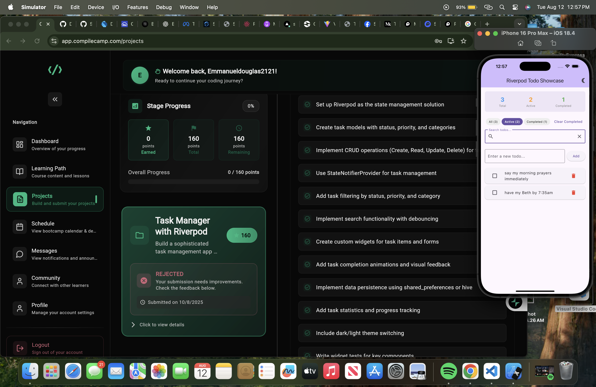

Sure! Here's a `README.md` file for your **Riverpod Todo App** project. It includes a project overview, setup instructions, features, and folder structure.

---

### 📄 `README.md`

```markdown
# ✅ Riverpod Todo App

A simple and clean Todo application built with **Flutter** and **Riverpod** for state management. This app demonstrates best practices with state management, filtering, and persistent UI patterns.

---

## 📸 Screenshots





---

## 🚀 Features

- Add, toggle, and delete todos
- Filter by: All, Active, Completed
- Task statistics: total, active, completed
- Built using `flutter_riverpod`
- Clean and reactive UI

---

## 🧠 Tech Stack

- [Flutter](https://flutter.dev)
- [Riverpod](https://riverpod.dev)
- Material UI
- Dart

---


## ğŸ› ï¸ Getting Started

### ✅ Prerequisites

- Flutter installed (`flutter doctor` must be clean)
- Any IDE (VSCode, Android Studio, etc.)

### 🔧 Installation

1. **Clone the repo**:
   ```bash
   git clone https://github.com/Douglasemmanuel/Todo-app.git
   cd todo_app
````

2. **Install dependencies**:

   ```bash
   flutter pub get
   ```

3. **Run the app**:

   ```bash
   flutter run
   ```

---

## 🧪 Running Tests

This project includes unit tests for providers:

```bash
flutter test
```

---

## 📬 Contact


* GitHub: [@yourusername](https://github.com/Douglasemmanuel?tab)

---

## 📠License

This project is licensed under the MIT License.

```

---

### ✅ Next Steps (Optional but Recommended)

1. Add screenshots under a `docs/` folder.
2. Replace the GitHub repo link with your actual URL.
3. Replace `yourhandle` and `yourusername` with your GitHub profile.

Would you like me to generate placeholder screenshots or set up the test files section in detail?
```
